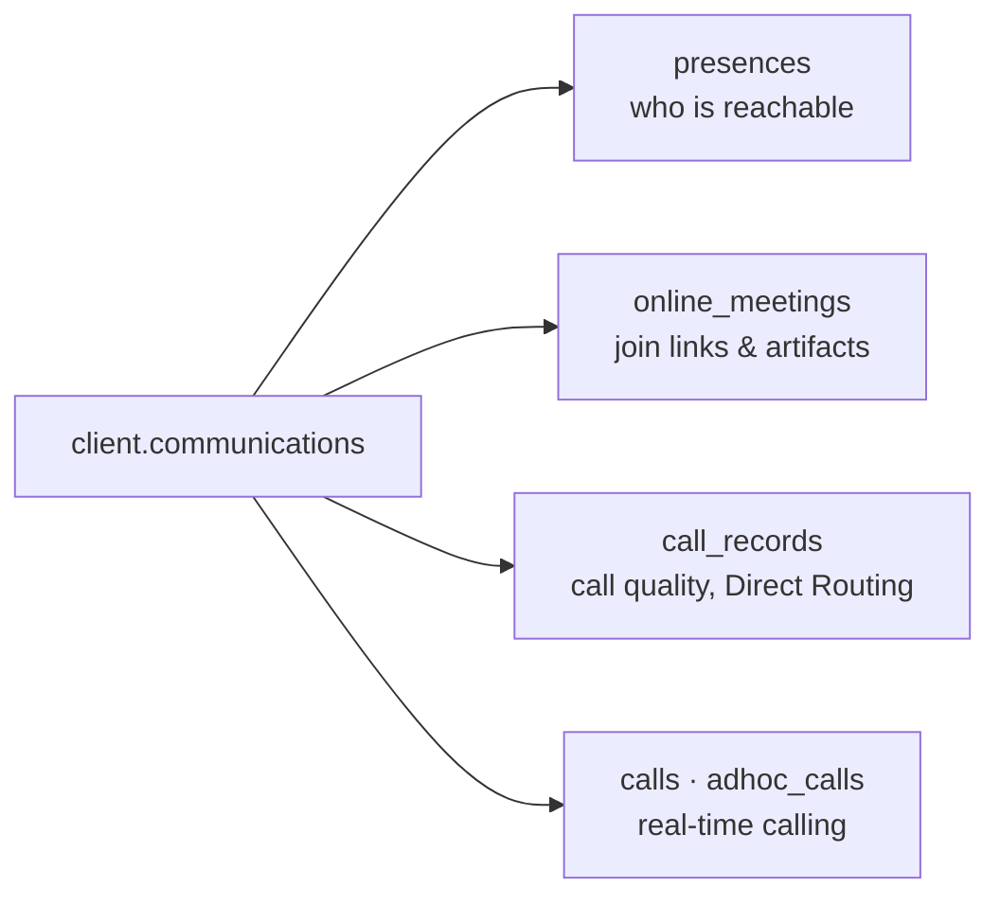

# Working with cloud communications

`client.communications` is Microsoft Graph's **cloud communications** endpoint:
presence, online meetings, calls and call records. "Communications" is the API
namespace, not a product — Teams, a contact centre or a softphone all sit on top
of it.

## The model


```mermaid
flowchart LR
    C["client.communications"] --> P["presences<br/>who is reachable"]
    C --> M["online_meetings<br/>join links &amp; artifacts"]
    C --> CR["call_records<br/>call quality, Direct Routing"]
    C --> CA["calls · adhoc_calls<br/>real-time calling"]
```

Three independent areas — with three different permission stories:

| Area | Who may call it | Folder |
| --- | --- | --- |
| Presence | a user's own presence (delegated) | [`presence/`](./presence/) |
| Online meetings | the signed-in organizer's meetings (delegated) | [`meetings/`](./meetings/) |
| Call records | **application only** — no "my calls" version | [`callrecords/`](./callrecords/) |

Real-time `calls` and `adhoc_calls` need a media bot (application- or
service-hosted media), so they are out of scope here.

## Start here

```bash
cp .env.example .env
uv run python examples/communications/quickstart.py
```

→ [`quickstart.py`](./quickstart.py) connects and reads your own presence. If it
prints a status, your app registration and consent are fine.

## Presence — is this person reachable?

[`presence/`](./presence/) · `Presence.Read` (own) · `Presence.Read.All` (anyone) · `Presence.ReadWrite` (change)

One resource per user, kept current by Teams. Read one user, read 650 at once,
or override your own status for a fixed window.

```python
presence = client.me.presence.get().execute_query()
print(presence.availability, presence.activity)  # e.g. Busy / InACall

for presence in client.communications.get_presences_by_user_id(upns).execute_query():
    print(presence.id, presence.availability)  # one request, many users
```

## Online meetings — join links without a calendar

[`meetings/`](./meetings/) · `OnlineMeetings.ReadWrite`

An online meeting is *not* a calendar event: you get a `joinWebUrl` and nothing
lands in anyone's inbox. Post the link as an event body if you do want an invite
([`../outlook/events/online_meeting.py`](../outlook/events/online_meeting.py)).

```python
meeting = client.me.online_meetings.create(
    subject="Project sync", start_datetime=start, end_datetime=end
).execute_query()
print(meeting.join_web_url)
```

Idempotent creation is available too — `create_or_get(external_id=…)` returns the
existing meeting when your external id is already known, which makes retries and
booking syncs safe.

## Call records — call quality and PSTN

[`callrecords/`](./callrecords/) · `CallRecords.Read.All` (application)

A record is the call, a **session** is one endpoint's leg, a **segment** is a
media stream inside it. Records are retained for 30 days and the feed rejects
`$top`, so filter on `startDateTime`. Direct Routing calls are a flat log
(`get_direct_routing_calls`) rather than entities.

## Why is this folder not under `teams/`?

Because it is not the Teams API. Presence, online meetings and call records are
their own Graph namespace — `client.communications` — with their own endpoint and
their own scopes, and this tree mirrors the client: one folder per namespace. The
only overlap with the product is online meetings, so [`../teams/`](../teams/)
links here instead of duplicating the code.

## Official docs

- [Cloud communications API overview](https://learn.microsoft.com/en-us/graph/api/resources/communications-api-overview)
- [Presence API](https://learn.microsoft.com/en-us/graph/api/resources/presence)
- [Online meetings](https://learn.microsoft.com/en-us/graph/api/resources/onlinemeeting)
- [Call records API](https://learn.microsoft.com/en-us/graph/api/resources/callrecords-api-overview)
